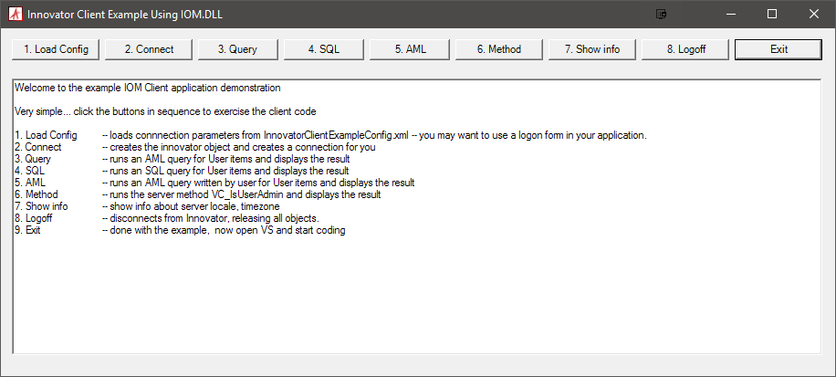

# Innovator Client Example

A sample Windows application that connects to an Aras instance.

## History

Release | Notes
--------|--------
[v1.0.1](https://github.com/ArasLabs/innovator-client-example/releases/tag/v1.0.1) | Updated Install steps 
[v1](https://github.com/ArasLabs/innovator-client-example/releases/tag/v1) | Migrated from the old Aras Community Projects site and updated.

#### Supported Aras Versions

Project | Aras
--------|------
[v1.0.1](https://github.com/ArasLabs/innovator-client-example/releases/tag/v1.0.1) | 10.0 SPx, 11.0 SPx
[v1](https://github.com/ArasLabs/innovator-client-example/releases/tag/v1) | 10.0 SPx, 11.0 SPx

## Installation

#### Important!
**Always back up your code tree and database before applying an import package or code tree patch!**

### Pre-requisites

1. Aras Innovator installed (version 11.0 SPx preferred)
2. Microsoft Visual Studio 2012+

### Install Steps

1. Add the IOM reference.
    1. Remove the existing IOM reference from the Solution Explorer under Solution > InnovatorClientExample.cs > References.
    2. Right click on References and select "Add Reference".
    3. Click the "Browse" button in the Reference Manager dialog.
    4. Navigate to your Innovator install directory then Innovator\Server\bin.
    5. Select IOM.dll and click "Add".
2. Modify `InnovatorClientExampleConfig.xml` in the root project directory/solution so that `<vault>`, `<server>` and `<database>` point to your installation of the Aras Innovator.
3. Build the solution.
4. Run the executable: `InnovatorClientExample\bin\Debug\InnovatorClientExample.exe`.

## Usage

Follow the directions in the application window to test out the different action buttons. Check out the application source for the sample code that executes for each action button.

## Contributing

1. Fork it!
2. Create your feature branch: `git checkout -b my-new-feature`
3. Commit your changes: `git commit -am 'Add some feature'`
4. Push to the branch: `git push origin my-new-feature`
5. Submit a pull request

For more information on contributing to this project, another Aras Labs project, or any Aras Community project, shoot us an email at araslabs@aras.com.

## Credits

Original code written by Aras Support.

Updated by Alexander Sklyarskiy for Aras Labs.

## License

Aras Labs projects are published to Github under the MIT license. See the [LICENSE file](./LICENSE.md) for license rights and limitations.
